## Índice

1. [🖧 Sistema Distribuído de Armazenamento de Pares Chave-Valor](#sistema)  
2. [⚙️ Funcionalidades principais](#funcionalidades)  
3. [🏗️ Arquitectura do sistema](#arquitetura) 
4. [🏛️ Diagrama de arquitetura do sistema](#diagrama) 
5. [🛠️ Pré-requisitos](#requisitos) 
6. [🐧 Instalação e arranque Linux V1](#linux_v1) 
7. [🐧 Instalação e arranque Linux V2](#linux_v2) 
8. [📦 Instalação e arranque Windows](#windows) 
9. [☁️ Instalação e uso em cloud e standalone](#cloud) 
10. [💻 Demo Terminal (em caso da interface http://localhost/ apresentar algum erro)](#terminal) 
11. [🌐 Demo Frontend](#frontend) 
12. [📖 Manual da API](#api) 
13. [🧪 Testes de carga com siege e build sem print de logs (modo detached) vs com print de logs](#siege)  
14. [💉 Testes de carga com ab e build sem print de logs (modo detached) vs com print de logs](#ab)  
15. [📝 Nota Importante dos testes de carga](#nota)  
16. [🚀 Resultados típicos para grandes testes de carga](#resultados)
17. [📕 Documentação Complementar](#complementar)  
18. [📄 Licença](#licenca)

---

<h2 id="sistema">🖧 Sistema Distribuído de Armazenamento de Pares Chave-Valor</h2>

Um sistema distribuído de leitura e escrita de pares chave-valor, baseado em micro-serviços orquestrados por Docker Compose. Inclui:

- **Duas réplicas de API** (api1 e api2) em FastAPI  
- **Cache Redis** para aceleração de leituras  
- **Base de dados PostgreSQL** para persistência  
- **RabbitMQ** como broker de mensagens duráveis (filas add_key e del_key)  
- **Serviço consumidor** que processa operações em background  
- **Nginx** como proxy reverso e balanceador de carga  

---

<h2 id="funcionalidades">⚙️ Funcionalidades principais</h2>

- **Cache-aside**: leituras vão primeiro ao Redis e, em caso de cache-miss, ao PostgreSQL, guardando depois em cache.  
- **Escrita/remoção assíncrona**: PUT/DELETE enfileiram mensagens no RabbitMQ; o consumer aplica insert/update/delete em PostgreSQL e atualiza o cache.  
- **Durabilidade e fiabilidade**: filas duráveis + mensagens persistentes + acknowledgements garantem que nenhuma operação se perde, mesmo em falhas.  
- **Ordenação e at-most-once**: cada mensagem inclui timestamp e apenas operações mais recentes são aplicadas.  
- **Escalabilidade horizontal**: basta aumentar réplicas de APIs ou de consumers conforme a carga.  

---

<h2 id="arquitetura">🏗️ Arquitectura do sistema</h2>

1. **FastAPI (api1 & api2)**  
   - Endpoints HTTP:  
     - `GET  /api?key=<chave>` → devolve valor e origem (`redis` ou `postgres`)  
     - `GET  /api/all`           → lista todos os pares  
     - `PUT  /api`               → Coloca em fila operação de escrita  
     - `DELETE /api`             → Coloca em fila operação de remoção  

2. **RabbitMQ**  
   - Filas duráveis `add_key` e `del_key`  
   - Mensagens com `delivery_mode=2` (persistentes) e timestamp  

3. **Consumer (workers)**  
   - Lê filas em paralelo, com `basic_qos(prefetch_count=…)`  
   - Aplica `INSERT … ON CONFLICT …` ou `DELETE` em PostgreSQL  
   - Atualiza ou elimina entradas no Redis  

4. **Redis**  
   - Cache-aside de valores  
   - TTL definido pela aplicação ou sem expiração (conforme necessidade)  

5. **PostgreSQL**  
   - Tabela `kv_store(key TEXT PRIMARY KEY, value TEXT, last_updated TIMESTAMP)`  

6. **Nginx**  
   - Proxy reverso e balanço/gestao de carga entre `api1` e `api2`  

7. **Scaler**  
   - Serviço scale_monitor que vigia o uso de memória RAM do sistema, para que, sempre que ultrapassa 70%, dispara automaticamente o arranque de réplicas adicionais das APIs, garantindo capacidade de processamento e continuidade de serviço.  

---

<h2 id="diagrama">🏛️ Diagrama de arquitetura do sistema</h2>

<p align="left">
  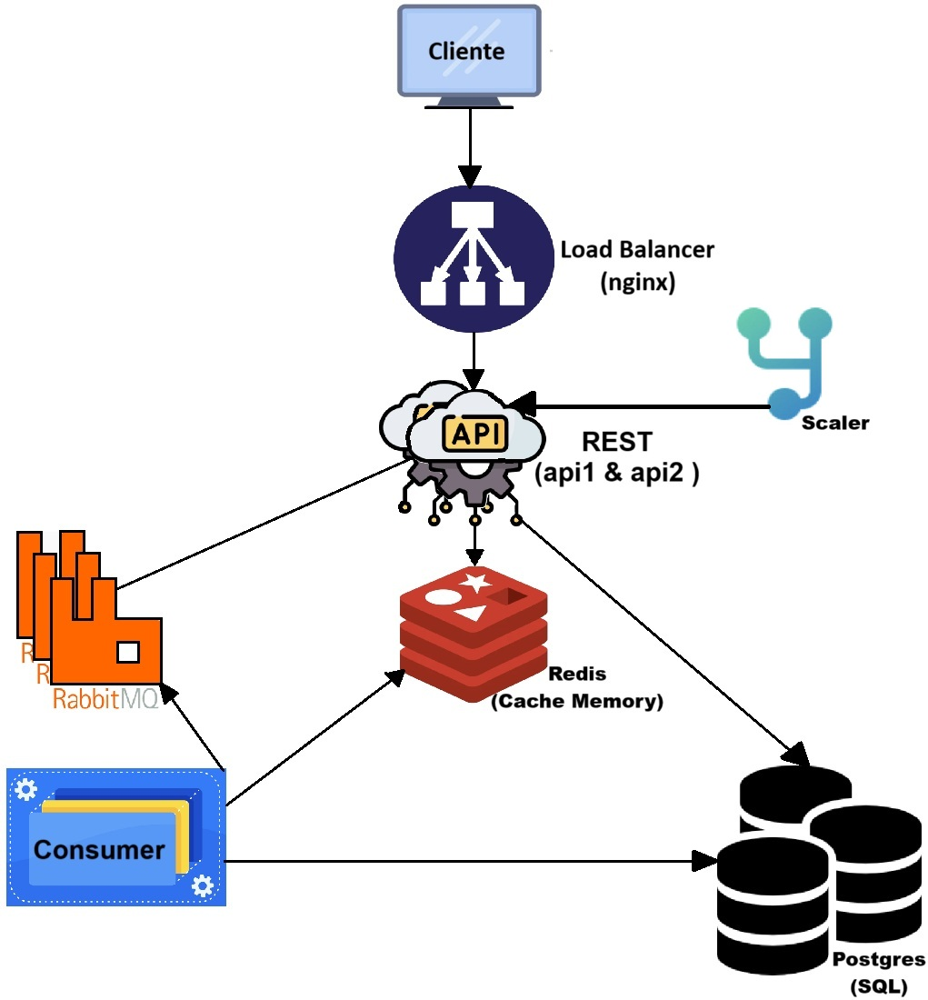
</p>

- **Mais detalhes**:Ver [Sistemas_Distribuidos.pdf](Sistemas_Distribuidos.pdf) ("Implementações avaliadas - pag. 10")

---

<h2 id="requisitos">🛠️ Pré-requisitos</h2>

- Docker & Docker Compose  
- Make  
- git
- (Opcional) `siege` ou `ab` para testes de carga  
- (Opcional) Em Windows, instalar Ubuntu

---

<h2 id="linux_v1">🐧 Instalação e arranque Linux V1</h2>

1. Clone o repositório  
   ```bash
   git clone https://github.com/a74872/SPD

2. Ir para a pasta onde o clone foi realizado o clone
   ```bash
   cd SPD

3. Utilize o Makefile (recomendado)
   ```bash
   make

4. Ou manualmente
   ```bash
   docker-compose down --volumes
   docker-compose build --no-cache
   docker-compose up

5. Espere o build acabar, e aceda à interface em: http://localhost/

> **Para mais detalhes** ver [Sistemas_Distribuidos.pdf](Sistemas_Distribuidos.pdf) ("Automação e reprodutibilidade - pag. 12").

---

<h2 id="linux_v2">🐧 Instalação e arranque Linux V2</h2>

1. Clone o repositório  
   ```bash
   git clone https://github.com/a74872/SPD

2. Ir para a pasta onde o clone foi realizado o clone
   ```bash
   cd SPD

3. Utilize o ficheiro start.sh
   ```bash
   chmod +x start.sh
   ./start.sh

4. Ou manualmente
   ```bash
   docker-compose down --volumes
   docker-compose build --no-cache
   docker-compose up

5. Espere o build acabar, e aceda à interface em: http://localhost/

> **Para mais detalhes** ver [Sistemas_Distribuidos.pdf](Sistemas_Distribuidos.pdf) ("Automação e reprodutibilidade - pag. 12").

---

<h2 id="windows">📦 Instalação e arranque Windows</h2>

1. Clone o repositório
   ```cmd
   git clone https://github.com/a74872/SPD
   cd SPD

2. Ir para a pasta onde o clone foi realizado o clone
   ```cmd
   cd SPD

3. Fazer Build
   ```cmd
   docker-compose down --volumes
   docker compose build --no-cache
   docker-compose up

4. Espere o build acabar, e aceda à interface em: http://localhost/

> **Para mais detalhes** ver [Sistemas_Distribuidos.pdf](Sistemas_Distribuidos.pdf) ("Automação e reprodutibilidade - pag. 12").

---

<h2 id="cloud">☁️ Instalação e uso em cloud e standalone</h2>

- **Este projeto** pode ser executado tanto em ambiente standalone (no seu PC de desenvolvimento Windows, macOS ou Linux) como em qualquer cloud provider (Google Cloud, AWS, Azure, DigitalOcean, …), desde que disponha de uma máquina virtual (VM) com Docker e Docker Compose instalados.

- **Implantação em ambiente cloud e criação da VM :** Escolha o seu provider (GCP, AWS, Azure, DigitalOcean…). Crie uma instância com SO Linux (Ubuntu/Debian) ou Windows Server. Garanta que tem pelo menos 2 vCPUs e 4 GB RAM para testes leves (ou mais para cargas elevadas).

- **Configurar a VM :** Abra SSH (Linux/macOS) ou RDP/PowerShell remota (Windows). Os restantes passos e pré-requisitos (instalação do Docker, Docker Compose, Makefile ou start.sh, clonagem do repositório e comandos de arranque) já foram descritos anteriormente (acima) para os ambientes Windows e Linux.

---

<h2 id="terminal">💻 Demo Terminal (em caso da interface http://localhost/ apresentar algum erro)</h2>

- **Put**: 
Para inserir um par chave-valor no terminal utilize curl -X PUT http://localhost/api -H "Content-Type: application/json" -d '{"key":"minha_chave","value":"123"}' e obterá de imediato {"status":"queued"} com código HTTP 200 OK, indicando que a operação foi enfileirada; pode confirmar no pgAdmin4 ou em psql com SELECT * FROM kv_store; e verificar que a chave foi inserida.
1. Gravar um par chave-valor
   ```bash
   curl -X PUT http://localhost/api -H "Content-Type: application/json" -d '{"key":"minha_chave","value":"123"}'

- **Delete**: 
Para eliminar o par utilize curl -X DELETE http://localhost/api?key=minha_chave, que também retornará {"status":"queued"} com HTTP 200 OK, e depois confirme que a linha foi removida na tabela kv_store.
2. Eliminar um par chave-valor
   ```bash
   curl -X DELETE http://localhost/api?key=minha_chave

- **Get**: 
Para ler o valor dessa chave use curl http://localhost/api?key=minha_chave e receberá {"data":{"key":"minha_chave","value":"123"},"source":"postgres"} (ou "redis" se tiver cache), mostrando de onde veio a resposta.
3. Ler um par chave-valor
   ```bash
   curl http://localhost/api?key=minha_chave

- **List**: 
Por fim, para listar todos os pares armazenados use curl http://localhost/api/all, que devolverá {"data":[{"key":"outra_chave","value":"abc"},…]}, e pode novamente comparar com o conteúdo da tabela no pgAdmin4 ou via psql.
4. Listar todos os pares chave-valor
   ```bash
   curl http://localhost/api/all

---

<h2 id="frontend">🌐 Demo Frontend</h2>

- **Put**: 
Para inserir um novo par chave-valor através do frontend basta digitar no formulário o nome da chave e o valor (ambos strings) e clicar em “Salvar”. O frontend envia então uma requisição PUT para /api com um corpo JSON contendo os campos key e value, e devolve de imediato um HTTP 200 OK com {"status":"queued"}, indicando que a operação foi enfileirada no RabbitMQ. Um serviço consumidor retira em background essa mensagem da fila add_key e executa o INSERT ou UPDATE na tabela kv_store do PostgreSQL (atualizando também o cache Redis, se existir). Por fim, para confirmar que a inserção decorreu com sucesso, abra o pgAdmin4 (ou ligue-se via psql) à base de dados bd_spd e consulte a tabela kv_store – se encontrar a linha com a chave e o valor indicados, significa que o par foi efetivamente gravado.
<p align="center">
  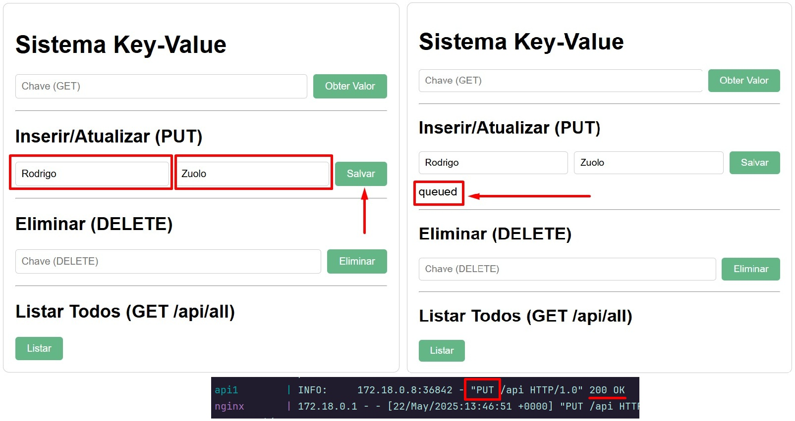
</p>

- **Get**: 
Para efetuar uma leitura (GET) de um par chave-valor, basta introduzir o nome da chave no campo de pesquisa e premir “Pesquisar”. O frontend envia imediatamente uma requisição GET para /api?key=<nome_da_chave>; se o valor estiver no cache Redis, recebe de imediato HTTP 200 OK com {"data":{"key":"<nome_da_chave>","value":"<valor>"},"source":"redis"}; em caso de cache miss, a API vai ao PostgreSQL, retorna o valor e guarda-o no Redis para consultas futuras, respondendo também com HTTP 200 OK e "source":"postgres". Para confirmar, abra o pgAdmin4 (ou use psql) e verifique se a linha existe na tabela kv_store ou volte a fazer GET para a mesma chave e observe "source":"redis" no resultado.
<p align="center">
  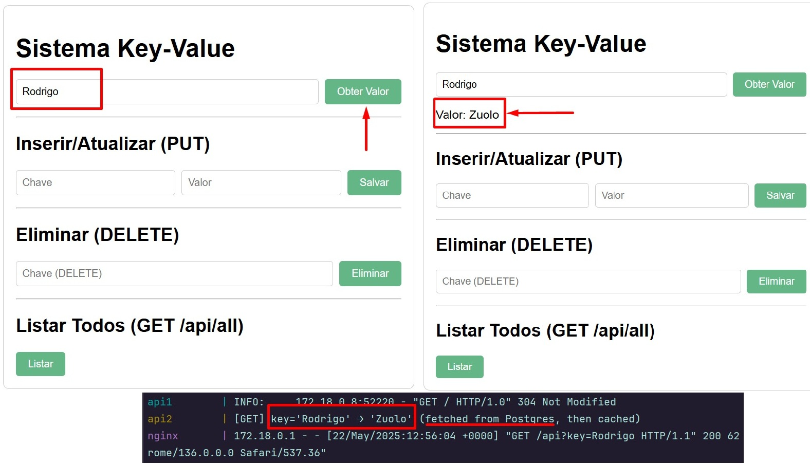
</p>

<p align="center">
  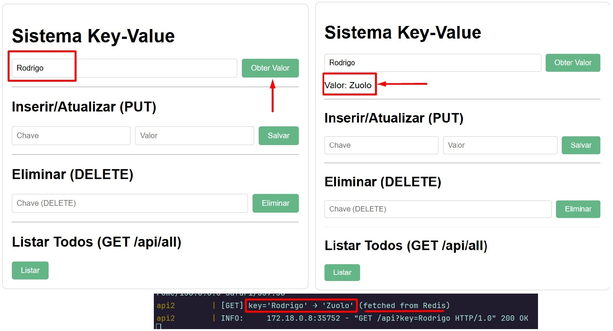
</p>

- **Delete**: 
Para eliminar um par chave-valor, escreva o nome da chave no campo correspondente e clique em “Eliminar”. O frontend dispara uma requisição DELETE para /api?key=<nome_da_chave> e devolve de imediato HTTP 200 OK com {"status":"queued"}, sinalizando que a operação foi enfileirada em del_key. O consumidor processa essa mensagem em background, remove a entrada da tabela kv_store no PostgreSQL e invalida a chave no Redis. Para verificar a exclusão, recorra ao pgAdmin4 (ou psql) e confirme que a linha já não está presente, ou faça um GET para essa chave e receba HTTP 404 Not Found.
<p align="center">
  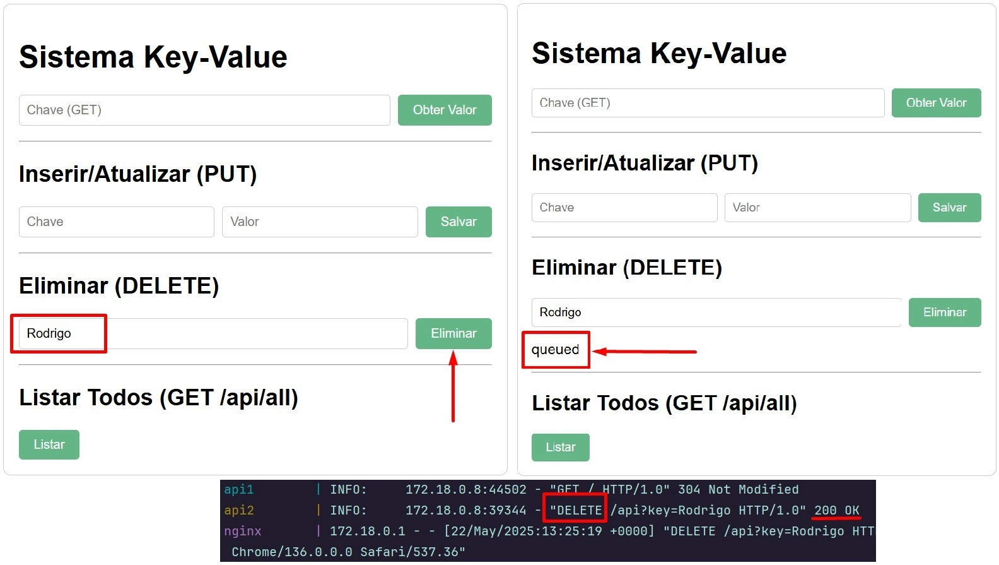
</p>

<p align="center">
  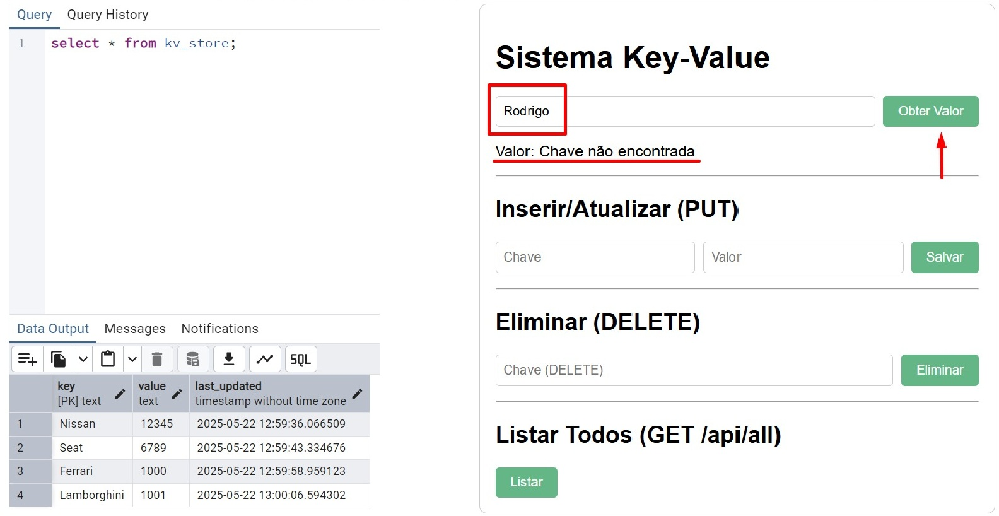
</p>

- **List**: 
Para listar todos os pares chave-valor, basta carregar no botão “Listar tudo” no frontend, que envia uma única requisição GET para /api/all; a API responderá com status 200 OK e um JSON contendo o array de objetos com cada key e value, e o frontend renderiza imediatamente essa lista (por exemplo, numa tabela), pelo que, para confirmar, pode igualmente abrir o pgAdmin4 ou usar psql com SELECT * FROM kv_store; e verificar que os resultados no banco coincidem com os apresentados.
<p align="center">
  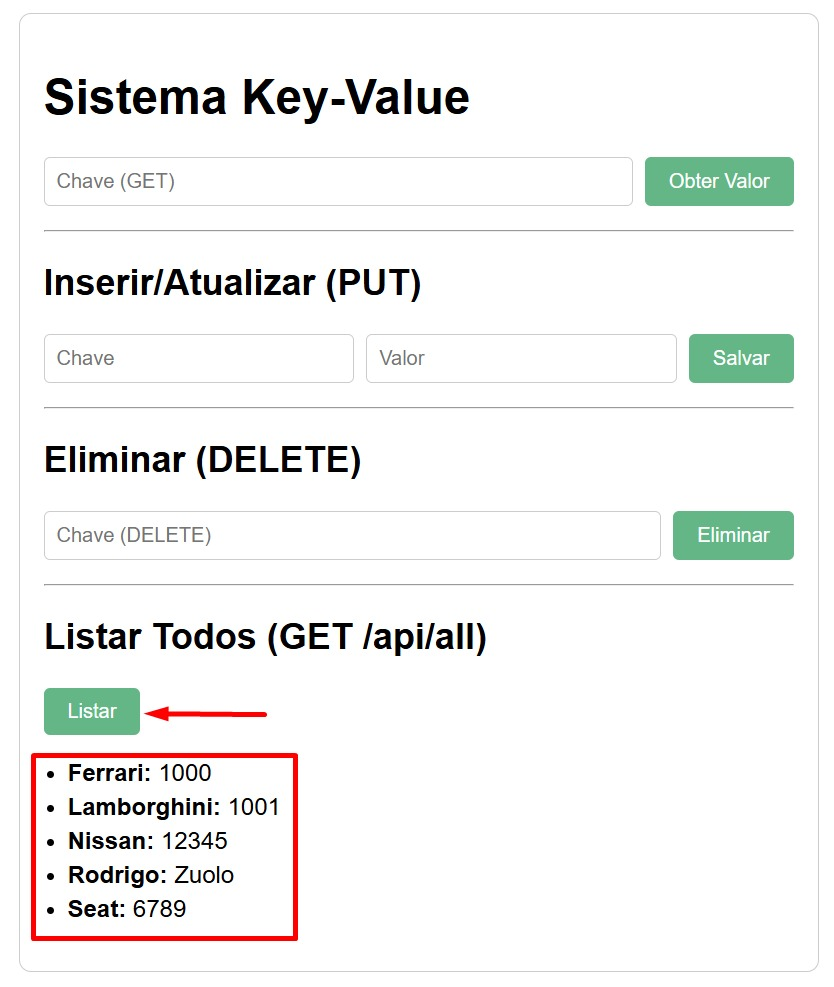
</p>

---

<h2 id="api">📖 Manual da API</h2>

- **Ver** [💻 Demo Terminal](#terminal) ❕❕❕

---

<h2 id="siege">🧪 Testes de carga com siege e build sem print de logs (modo detached) vs com print de logs</h2>

- **Siege**: Ver o ficheiro [commands_siege.txt](siege/commands_siege.txt) e [urls.txt](siege/urls.txt)
- **Resultados sem print de logs**: Em apenas cerca de 11min (693,86 segundos) foram processadas 1 632 000 requisições com o Siege, mantendo 0 perdas de dados, o que traduz um throughput médio de cerca de 2 351 req/s. Estes resultados assentam em vários factores de optimização: as APIs correm em modo detached (docker compose up -d), eliminando o overhead de I/O de logs em tempo real; o basic_qos(prefetch_count=50) no consumidor garante elevado débito sem riscos de mensagem perdida; as ligações ao RabbitMQ e ao PostgreSQL são reutilizadas, evitando o custo de abrir e fechar conexões a cada operação; e a estratégia cache-aside com Redis (no caso do get) reduz drasticamente a latência das leituras repetidas. No seu conjunto, estas escolhas permitem ao sistema escalar de forma linear sob cargas massivas, mantendo latências controladas e fiabilidade total, exemplo de grafico na figura da esquerda.
---
- **Resultados com print de logs**: Em cerca de 18min e no modo “foreground”, com todos os logs a serem enviados em tempo real para o terminal, o sistema processou apenas 204 000 requisições em 1 116,8 s (≈ 182,6 req/s), demonstrando um tronco de desempenho significativamente inferior ao cenário detached. Esta lentidão prende-se sobretudo com o overhead de I/O de logging: cada print() da aplicação, cada registo de acesso do Nginx/UVicorn/RabbitMQ percorre o pipeline de buffers, parsing e flushing para o terminal, criando um verdadeiro ponto de estrangulamento que retarda o processamento das requisições. Além disso, o multiplexing contínuo dos streams de saída e as sincronizações de buffer contribuem para aumentar a latência geral. Apesar de manter zero perdas de dados, este modo revela como o custo de logging em tempo real pode degradar severamente o throughput, passando de mais de 2 351 req/s em detached para cerca de 183 req/s com logs ativos, exemplo de grafico na figura da direita.

<p align="center">
  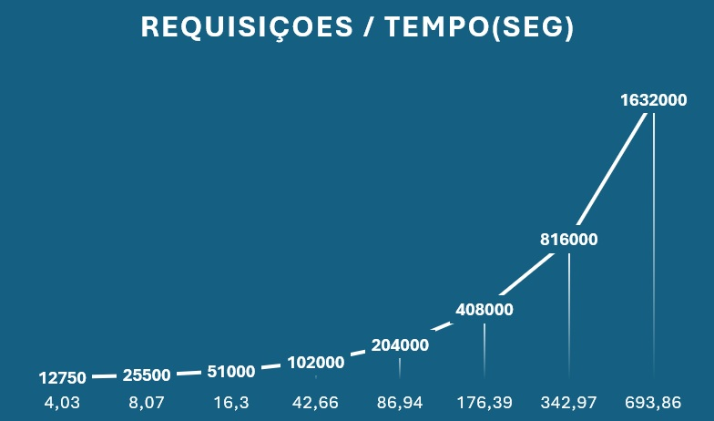 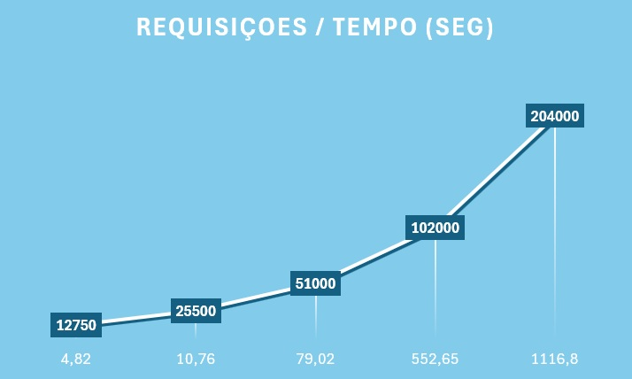,
</p>

---

<h2 id="ab">💉 Testes de carga com ab e build sem print de logs (modo detached) vs com print de logs</h2>

- **ApacheBench**: Ver o ficheiro [commands_ab.txt](ab/commands_ab.txt) e [body.txt](ab/body.txt)
- **Resultados sem print de logs**: Em cerca de 12min (727,89 segundos) o ApacheBench processou 1 632 000 requisições com 255 clientes concorrentes, mantendo 0 perdas de dados, o que corresponde a um throughput médio de aproximadamente 2 241 requisições por segundo. Estes resultados foram alcançados graças a várias otimizações: as APIs foram executadas em modo detached (docker compose up -d), eliminando o overhead de I/O associado ao streaming de logs em tempo real; foi configurado basic_qos(prefetch_count=50) no consumidor para maximizar o débito sem comprometer a fiabilidade das mensagens; as ligações TCP ao RabbitMQ e ao PostgreSQL são mantidas abertas e reutilizadas, evitando custos de estabelecimento de conexão em cada operação; e a estratégia cache-aside com Redis (no caso do get) aliviou significativamente a carga de leituras no PostgreSQL, reduzindo as latências. Em conjunto, estes fatores permitem ao sistema lidar com elevados níveis de concorrência mantendo a latência sob controlo e garantindo 100 % de consistência dos dados, exemplo de grafico na figura da esquerda.

- **Resultados com print de logs**: Em modo foreground, utilizando o comando ab -p body.txt -T "application/json" -s 500 -c 255 -n 100000 -m PUT http://localhost/api,conseguimos completar as 100 000 requisições em 593,927 segundos (≈ 168 req/s). Foi necessário especificar -s 500 porque, por omissão, o ab abortava o teste antes de chegar às 100 000 requisições, acusando um timeout nos sockets. No output, vê-se que o ab processou com sucesso os primeiros lotes de 10 000 e 20 000 pedidos, mas depois exibiu a mensagem, "apr_pollset_poll: The timeout specified has expired (70007)" e "Total of 23437 requests completed", que indica que a operação de leitura/escrita em socket demorou mais do que o limite interno (cerca de 20 s) e o teste foi interrompido após 23 437 requisições. Em resumo, o servidor não estava a responder rápido o suficiente ao ritmo imposto pelo ApacheBench, levando ao abortamento prematuro. A solução passou por aumentar o timeout com -s, ajustar parâmetros de carga (concorrência e total de requisições) ou, idealmente, optimizar o sistema — por exemplo, executando as APIs em modo detached (sem streaming de logs), reutilizando ligações persistentes a RabbitMQ e PostgreSQL, e escalonando réplicas de API para suportar a carga desejada, exemplo de grafico na figura da direita.

<p align="center">
  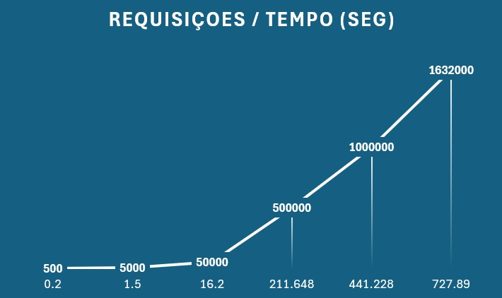 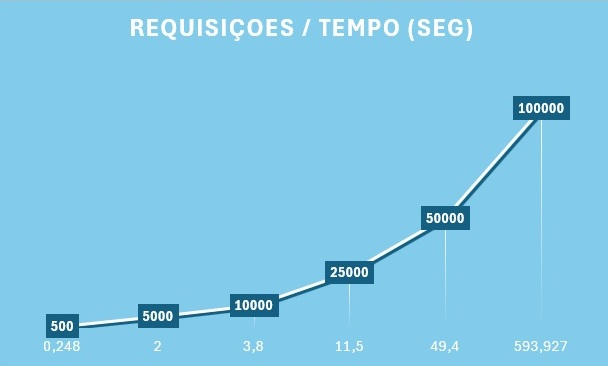,
</p>

---

<h2 id="nota">📝 Nota Importante dos testes de carga</h2>

Durante os testes de carga verificámos que executar o sistema em modo “foreground” (i.e. **docker compose up** sem -d) introduz um overhead de I/O que impacta diretamente o desempenho. Cada log enviado para o terminal—print()s da aplicação, mensagens do Nginx, UVicorn e RabbitMQ—obriga a múltiplas operações de flush, parsing e formatação, consumindo CPU e I/O de disco. Quando geramos centenas ou milhares de logs por segundo, o próprio terminal se torna um fator limitador, impondo throttling e constantes sincronizações de buffer para não perder saída, o que retarda significativamente o processamento de pedidos.

Em contrapartida, ao usar **docker compose up -d**, os containers correm em background sem despejar logs para o terminal, eliminando esse overhead de I/O. Nos nossos benchmarks, isso traduziu-se em throughput muito mais elevado e latências menores — prova de que a forma como gerimos o logging é um factor crítico a ter em conta em cenários de alta carga.

---

<h2 id="resultados">🚀 Resultados típicos para grandes testes de carga c/ e s/ modo detached :</h2>

- 1 632 000 de pedidos sem perda de mensagens (com basic_qos(prefetch_count=50)).
- Tempo de processamento reduzido de 45min para 7min após optimização de conexões.
- **RabitMQ**: Pode ver e gerir em tempo real praticamente tudo o que se passa no broker: http://localhost:15672/#/
- **Mais dados**:Ver [Sistemas_Distribuidos.pdf](Sistemas_Distribuidos.pdf) ("Discussão de Resultads - pag. 14")

<p align="left">
  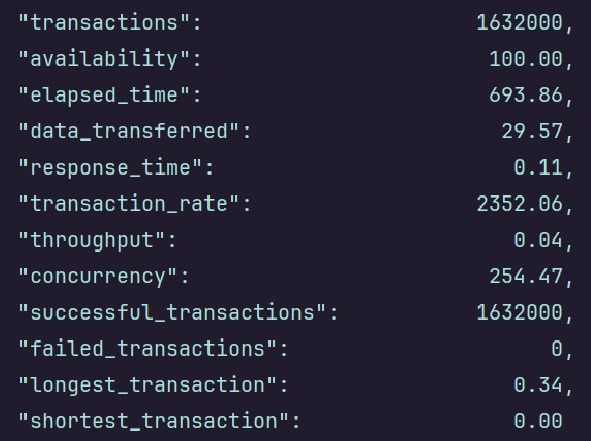 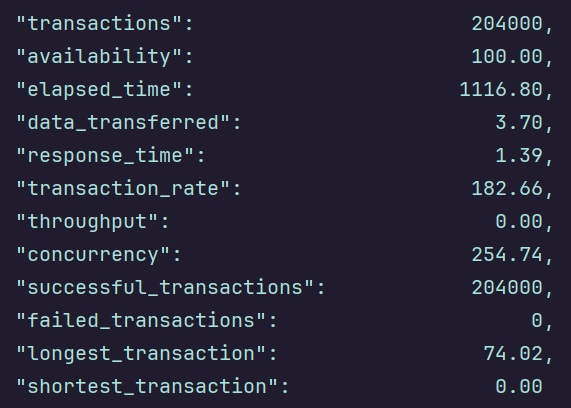  
</p>

---

<h2 id="complementar">📕 Documentação Complementar</h2>

[Sistemas_Distribuidos.pdf](Sistemas_Distribuidos.pdf)

**O PDF** começa por uma Introdução, onde se expõe o problema do armazenamento distribuído de pares chave-valor e os objetivos do projeto. Segue-se o Enquadramento, que contextualiza o trabalho em termos de sistemas paralelos e distribuídos, apresentando brevemente conceitos de processamento distribuído, as ferramentas e compiladores usados (Docker, Python, PostgreSQL, RabbitMQ, Redis, FastAPI) e o papel das APIs como interface REST. Depois, são descritas as métricas de avaliação (ApacheBench e Siege) e justifica-se a escolha de dimensões para o caso de estudo (número de clientes, volume de mensagens, latências aceitáveis).

No capítulo de Metodologia Experimental detalha-se o ambiente de testes (hardware, software, configuração Docker Compose), as implementações avaliadas (cada componente do sistema: APIs, cache, filas, consumer, base de dados, proxy e o próprio scaler de RAM), as práticas de automação e reprodutibilidade (Infrastructure as Code, Makefile, healthchecks) e o procedimento de medição (como foram executados os benchmarks, que parâmetros foram variáveis e quais ficaram fixos).

Em Discussão dos Resultados, analisam-se os padrões de tempo de execução real, a aceleração obtida ao desligar o logging em foreground, a eficiência do cache-aside e do prefetch no RabbitMQ, a escalabilidade prevista (linear ao adicionar réplicas) e o impacto da carga no comportamento geral do sistema. As conclusões da discussão sintetizam como as decisões de arquitetura contribuíram para fiabilidade total e baixas latências, mesmo sob mais de um milhão de requisições.

Finalmente, na Conclusão, recapitula-se a solidez da solução implementada e apontam-se possíveis melhorias futuras, e o documento encerra com as Referências que suportaram o estudo.

---

<h2 id="licenca">📄 Licença</h2>

- Este projecto está licenciado sob Vasile's Rules.
- Desenvolvido por Vasile Karpa – 2025
- Contacto: a74872@ualg.pt